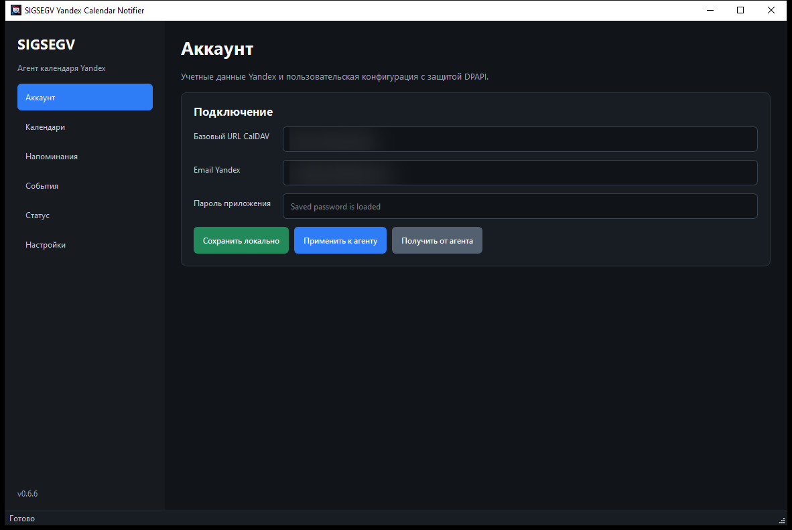
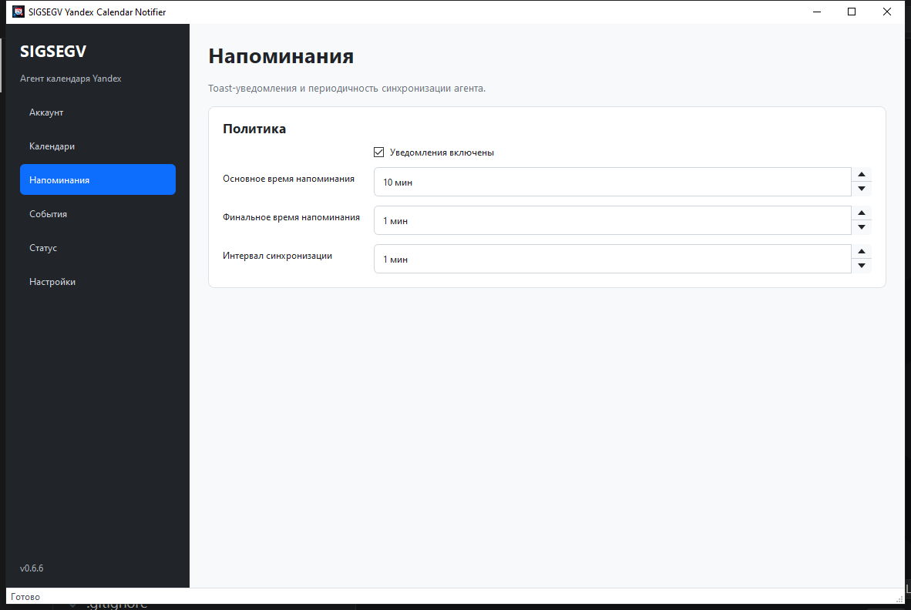
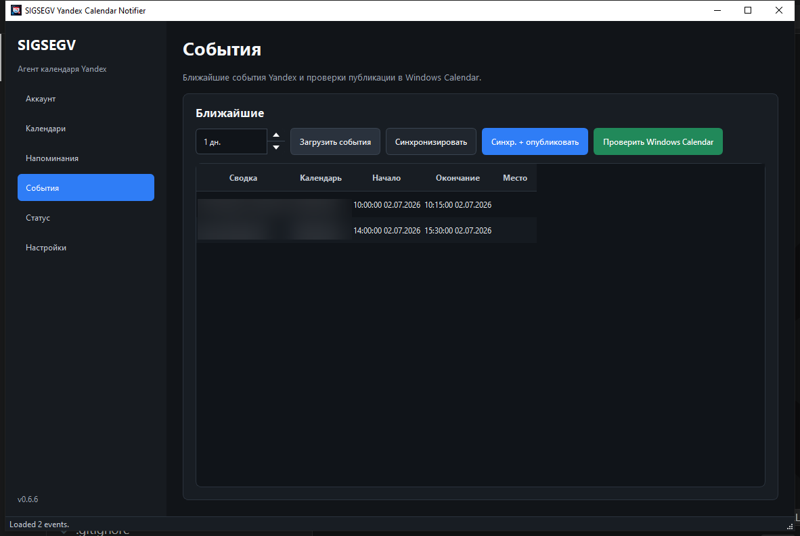
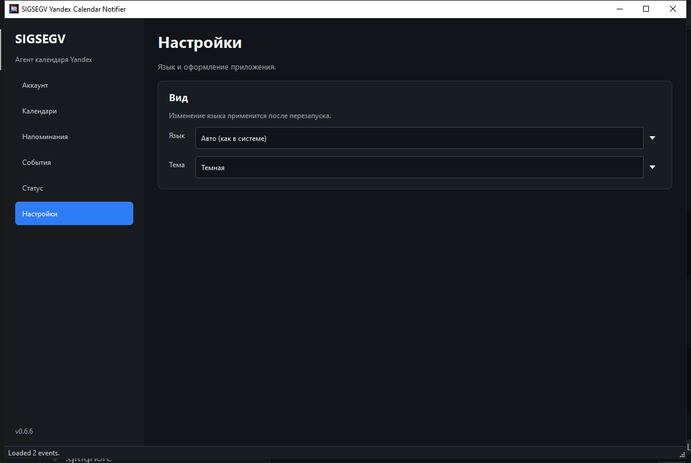

# Руководство пользователя

SIGSEGV Yandex Calendar Notifier помогает держать события из Yandex Calendar рядом с системным календарем Windows.
Приложение синхронизирует выбранные CalDAV-календари, публикует ближайшие события в Windows Calendar и показывает
toast-напоминания от имени текущего пользователя Windows.

Скриншоты ниже подготовлены для документации: email, URL, имена календарей и названия событий замылены.

## Установка

Скачайте из релиза два файла одного и того же номера версии:

- `SIGSEGVYandexCalendarNotifier-<version>.0-x64.msix` - приложение и фоновый агент.
- `SIGSEGVYandexCalendarNotifier-<version>.0-x64.cer` - сертификат подписи MSIX.

Если релиз подписан self-signed сертификатом, импортируйте `.cer` в доверенные корневые сертификаты из PowerShell,
запущенного от администратора:

```powershell
Import-Certificate `
  -FilePath .\SIGSEGVYandexCalendarNotifier-<version>.0-x64.cer `
  -CertStoreLocation Cert:\LocalMachine\Root
```

После этого установите MSIX для текущего пользователя:

```powershell
Add-AppxPackage -Path .\SIGSEGVYandexCalendarNotifier-<version>.0-x64.msix
```

## Аккаунт

Откройте `SIGSEGV Yandex Calendar Notifier` и заполните раздел **Аккаунт**.



Укажите базовый CalDAV URL Yandex, email аккаунта и пароль приложения Yandex. Пароль хранится локально через Windows
DPAPI и привязан к текущему пользователю Windows.

Кнопки в разделе:

- **Сохранить локально** записывает конфигурацию в профиль пользователя.
- **Применить к агенту** отправляет текущую конфигурацию уже запущенному фоновому агенту.
- **Получить от агента** читает конфигурацию из фонового агента и обновляет поля формы.

## Календари

В разделе **Календари** выберите коллекции CalDAV, которые должны синхронизироваться.

Нажмите **Найти календари**, чтобы получить список коллекций из Yandex. Оставьте галочки только у тех календарей,
события которых должны попадать в Windows Calendar и напоминания. При необходимости можно вручную добавить календарь
или удалить выбранную строку.

После изменения списка календарей нажмите **Сохранить локально**, затем **Применить к агенту**.

## Напоминания

Раздел **Напоминания** управляет toast-уведомлениями и частотой фоновой синхронизации.



Основное время напоминания используется для первого уведомления до начала события. Финальное время напоминания задает
повторное короткое предупреждение. Интервал синхронизации определяет, как часто агент обновляет ближайшие события.

## События

Раздел **События** нужен для ручной проверки синхронизации.



Доступные действия:

- **Загрузить события** показывает ближайшие события из агента за выбранный горизонт.
- **Синхронизировать** запускает синхронизацию CalDAV без публикации в Windows Calendar.
- **Синхр. + опубликовать** синхронизирует Yandex Calendar и публикует события в Windows Calendar.
- **Проверить Windows Calendar** запускает диагностику доступа к системному календарю Windows.

Во время долгих действий окно временно блокируется, а у курсора появляется системный индикатор загрузки.

## Статус

Раздел **Статус** управляет фоновым агентом текущего пользователя:

- **Установить агент** регистрирует автозапуск и сразу пытается запустить агент.
- **Запустить агент** стартует агент вручную для текущей сессии.
- **Удалить агент** снимает регистрацию автозапуска.

Журнал активности показывает последние операции, ответы агента и диагностические сообщения. Если синхронизация не
работает, сначала проверьте именно этот раздел.

## Настройки

В разделе **Настройки** можно выбрать язык интерфейса и тему.



Изменение языка применяется после перезапуска приложения. Тема может следовать системной настройке Windows или быть
зафиксирована в светлом/темном режиме.

## Где хранится конфигурация

Конфигурация хранится для каждого пользователя Windows отдельно:

```text
%LOCALAPPDATA%\SIGSEGVYandexCalendarNotifier\config.json
```

Пароль приложения не хранится открытым текстом: приложение записывает DPAPI-защищенное поле `app_password_dpapi`.
Такой файл нельзя безопасно перенести в другой Windows-аккаунт.

## Частые проблемы

Если App Installer показывает `0x800B0109` или `0x800B010A`, Windows не доверяет сертификату подписи. Импортируйте
`.cer` из того же релиза в `Cert:\LocalMachine\Root` и повторите установку MSIX.

Если приложение сообщает о несовпадении версий bridge и GUI, переустановите `.msix` и `.cer` из одного релиза.

Если события не появляются в Windows Calendar, откройте **События** и выполните **Синхр. + опубликовать**, затем
**Проверить Windows Calendar**. Подробности будут в разделе **Статус**.
