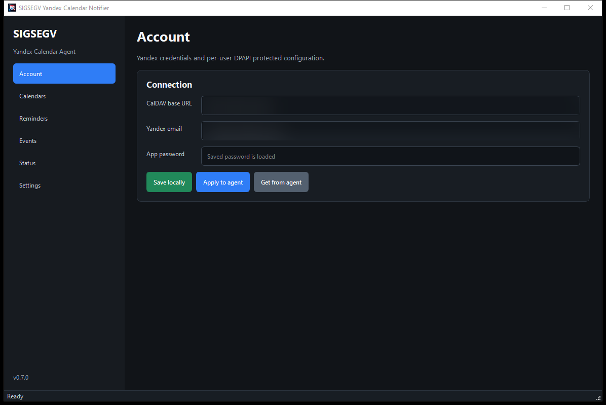
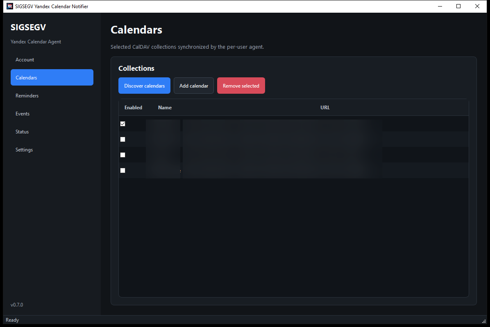
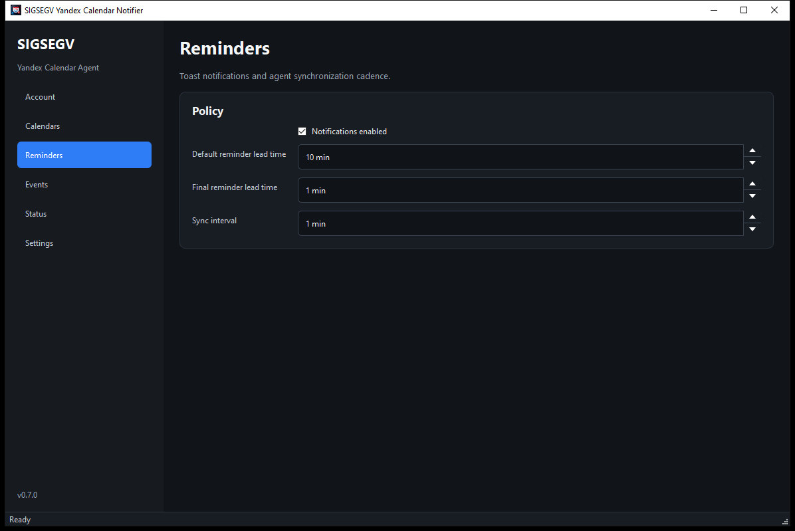
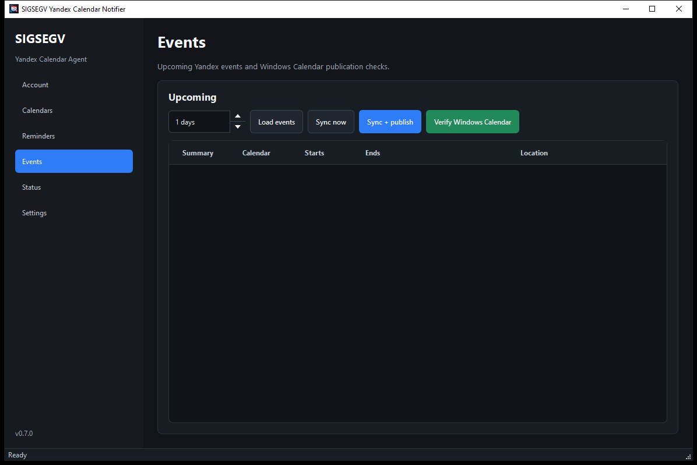
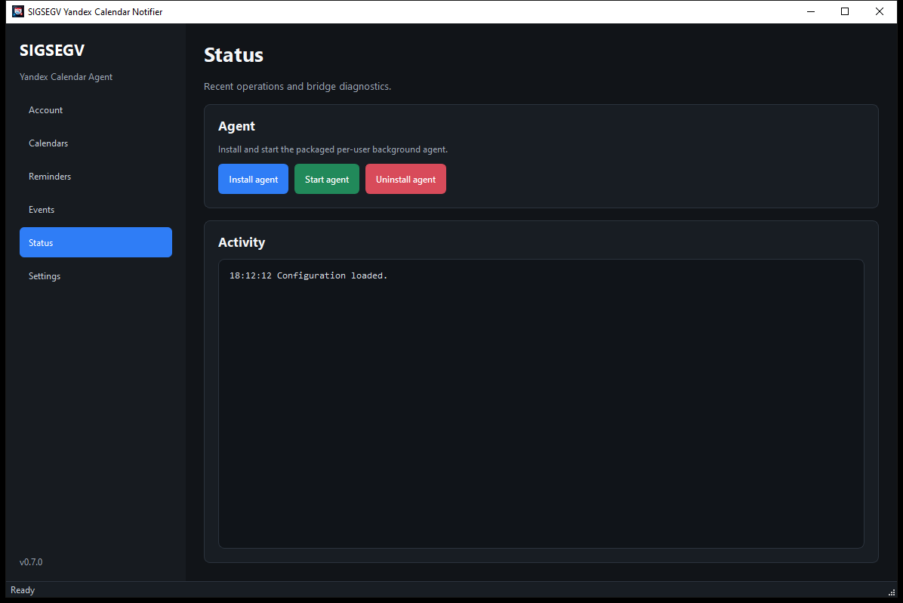
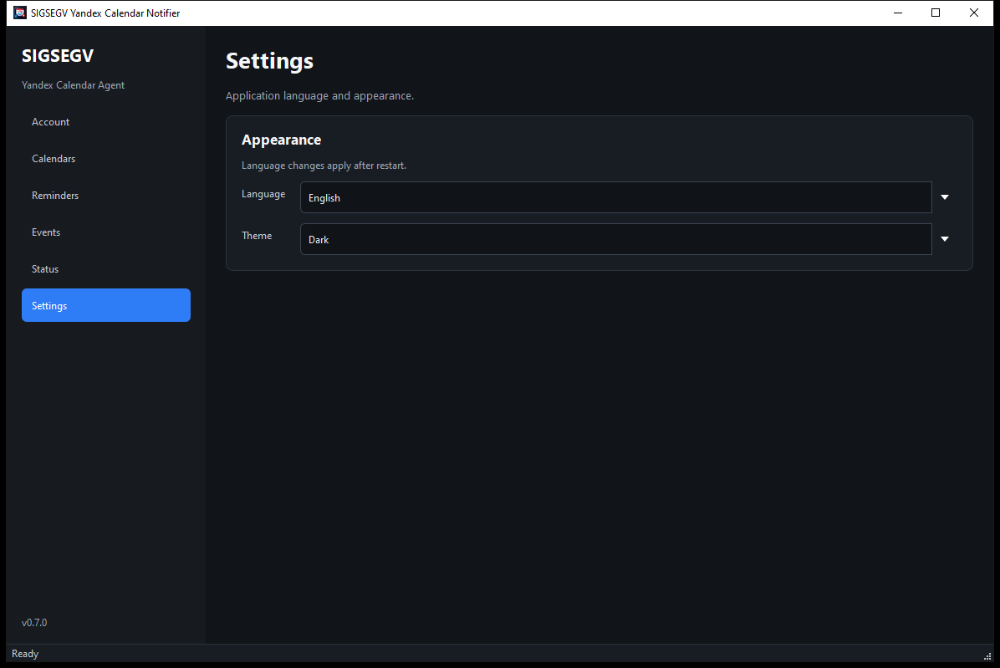

# User Guide

SIGSEGV Yandex Calendar Notifier keeps selected Yandex Calendar events close to the Windows calendar experience. The
app synchronizes selected CalDAV calendars, publishes upcoming events into the signed-in user's Windows Calendar, and
shows Windows toast reminders for the current Windows user.

The screenshots below are documentation-safe copies: email addresses, URLs, and calendar names are blurred.

## Installation

Download both files from the same release version:

- `SIGSEGVYandexCalendarNotifier-<version>.0-x64.msix` - the app and the background agent.
- `SIGSEGVYandexCalendarNotifier-<version>.0-x64.cer` - the MSIX signing certificate.

If the release is signed with a self-signed certificate, import the `.cer` file into the trusted root certificate store
from an elevated PowerShell session:

```powershell
Import-Certificate `
  -FilePath .\SIGSEGVYandexCalendarNotifier-<version>.0-x64.cer `
  -CertStoreLocation Cert:\LocalMachine\Root
```

Then install the MSIX for the current Windows user:

```powershell
Add-AppxPackage -Path .\SIGSEGVYandexCalendarNotifier-<version>.0-x64.msix
```

## Account

Open `SIGSEGV Yandex Calendar Notifier` and fill in the **Account** section.



Enter the Yandex CalDAV base URL, the Yandex account email, and the Yandex app password. The app password is stored
locally through Windows DPAPI and is tied to the current Windows user.

Account actions:

- **Save locally** writes the configuration into the user's local profile.
- **Apply to agent** sends the current configuration to the already running background agent.
- **Get from agent** reads the configuration from the background agent and refreshes the form.

## Calendars

Use **Calendars** to choose the CalDAV collections that should be synchronized.



Click **Discover calendars** to fetch the collection list from Yandex. Keep enabled only the calendars whose events
should be published into Windows Calendar and used for reminders. You can also add a calendar manually or remove the
selected row.

After changing the calendar list, click **Save locally**, then **Apply to agent**.

## Reminders

The **Reminders** section controls toast notifications and the background synchronization cadence.



The default reminder lead time is used for the first notification before an event starts. The final reminder lead time
sets a shorter follow-up warning. The sync interval controls how often the agent refreshes upcoming events.

## Events

Use **Events** for manual synchronization checks.



Available actions:

- **Load events** shows upcoming events reported by the agent for the selected time horizon.
- **Sync now** starts a CalDAV synchronization without publishing to Windows Calendar.
- **Sync + publish** synchronizes Yandex Calendar and publishes events into Windows Calendar.
- **Verify Windows Calendar** runs diagnostics for the Windows Calendar integration.

During long-running actions, the window is temporarily disabled and the system busy cursor is shown.

## Status

The **Status** section manages the current user's background agent:



- **Install agent** registers startup and immediately tries to start the agent.
- **Start agent** starts the agent manually for the current session.
- **Uninstall agent** removes the startup registration.

The activity log shows recent operations, agent responses, and diagnostic messages. If synchronization does not work,
start troubleshooting from this section.

## Settings

Use **Settings** to choose the UI language and theme.



Language changes apply after restarting the app. The theme can follow the Windows system setting or be fixed to light or
dark mode.

## Configuration Storage

Configuration is stored separately for each Windows user:

```text
%LOCALAPPDATA%\SIGSEGVYandexCalendarNotifier\config.json
```

The app password is not stored as plain text. The app writes the DPAPI-protected `app_password_dpapi` field instead.
That protected value cannot be safely moved to another Windows account.

## Common Issues

If App Installer shows `0x800B0109` or `0x800B010A`, Windows does not trust the signing certificate. Import the `.cer`
from the same release into `Cert:\LocalMachine\Root`, then retry the MSIX installation.

If the app reports a bridge/GUI version mismatch, reinstall the `.msix` and `.cer` from the same release.

If events do not appear in Windows Calendar, open **Events** and run **Sync + publish**, then **Verify Windows
Calendar**. Details will be shown in **Status**.
