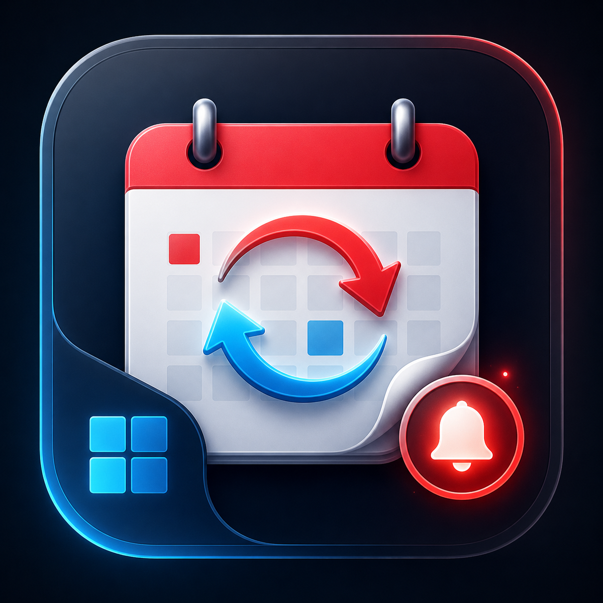

# Windows Calendar Bridge



## Decision

`ycn_calendar_bridge.exe` is now the packaged per-user background agent. Background sync belongs to the signed-in
Windows user.

The agent is responsible for:

- loading the current user's configuration from `%LOCALAPPDATA%\SIGSEGVYandexCalendarNotifier\config.json`;
- decrypting the Yandex app password with DPAPI for the current Windows user;
- polling Yandex CalDAV on the configured interval;
- keeping the per-user local store at `%LOCALAPPDATA%\SIGSEGVYandexCalendarNotifier\local-store.tsv`;
- publishing events into Windows Calendar with `AppointmentStore`;
- dispatching reminder notifications as Windows toast notifications;
- exposing the existing local named-pipe IPC API so `ycn_config_app.exe` can configure and inspect the running agent.

## Why It Must Be Per-User And Packaged

Windows Calendar data belongs to the signed-in user profile. Writing it from a machine-wide service identity is the
wrong ownership model, and it also breaks notification delivery because reminders are user-session UI.

The Windows Appointment APIs require package identity plus the `appointmentsSystem` capability:

- https://learn.microsoft.com/en-us/uwp/api/windows.applicationmodel.appointments.appointmentstore
- https://learn.microsoft.com/en-us/uwp/api/windows.applicationmodel.appointments.appointmentcalendar

Desktop WinRT APIs that require package identity are supported for packaged desktop apps:

- https://learn.microsoft.com/en-us/windows/apps/desktop/modernize/winrt-api-desktop-app-support

For that reason, Windows Calendar publication and toast notification delivery are owned by the MSIX-packaged
`ycn_calendar_bridge.exe`.

## CLI Contract

```powershell
ycn_calendar_bridge.exe --probe
ycn_calendar_bridge.exe --run
ycn_calendar_bridge.exe --install
ycn_calendar_bridge.exe --uninstall
ycn_calendar_bridge.exe --sync-and-publish
ycn_calendar_bridge.exe --publish
ycn_calendar_bridge.exe --verify
```

- `--run` starts the foreground agent loop for the current user. The autostart launcher waits for the local IPC pipe before reporting success, so a successful launch means the agent is ready for GUI requests.
- `--install` registers redundant per-user startup entries for the native windowless autostart launcher: an `HKCU\Software\Microsoft\Windows\CurrentVersion\Run` value, a Startup folder shortcut, and the Scheduled Task `SIGSEGVYandexCalendarBridge` with an at-logon trigger and a 30-second startup delay. The task also includes session-state triggers for Remote Desktop reconnect, session unlock, and console reconnect, because `mstsc` can attach to an existing Windows session without firing a new logon. The redundancy is intentional because Windows can activate those mechanisms differently for console logons and RDP sessions. When `--install` runs from the MSIX package, all registrations point at the packaged sibling `ycn_calendar_bridge_autostart.exe` so logon startup keeps package identity without depending on App Execution Alias activation from Task Scheduler. Unpackaged/manual runs still prefer the App Execution Alias path under `%LOCALAPPDATA%\Microsoft\WindowsApps` to avoid registering the raw MSI helper.
- `--uninstall` removes all startup registrations and also cleans the legacy `HKCU\Software\Microsoft\Windows\CurrentVersion\Run` value shape used by earlier versions.
- `--sync-and-publish` asks the running agent over IPC to sync CalDAV, then publishes the refreshed event snapshot.
- `--publish` republishes the current agent snapshot without forcing a sync.
- `--verify` checks the expected events by Windows Calendar `RoamingId`.
- `--probe` verifies package identity and performs a temporary AppointmentStore write/read/delete probe.

The configuration app refuses lifecycle operations when the MSIX bridge alias reports a different version than the GUI.
This protects upgrades from accidentally starting an older packaged bridge that remained installed from a previous
release.

## AppointmentStore Implementation

The bridge contract lives in `include/ycn/windows_calendar_bridge.hpp`.

The real backend is implemented in `src/core/windows_calendar_bridge.cpp`:

- detects whether the current process has package identity;
- requests `AppointmentStoreAccessType::AppCalendarsReadWrite`;
- creates or reuses an app-owned `UserDataAccount` named `SIGSEGV Yandex Calendar`;
- creates or reuses per-source calendars named `Yandex: <display name>` inside that account;
- maps every Yandex event to a stable Windows `Appointment.RoamingId`;
- expands CalDAV recurrence data into individual publishable appointment instances inside the requested horizon;
- upserts appointments by deleting any prior local appointment IDs for that `RoamingId`, then saving a fresh
  `Appointment`;
- removes appointments for events that disappeared from the current agent snapshot.

The app-owned account is intentional. Some Windows builds return `0x80070032` (`ERROR_NOT_SUPPORTED`) from the
no-account `CreateAppointmentCalendarAsync(name)` overload even when the app has package identity and
`appointmentsSystem`. Binding calendars through `CreateAppointmentCalendarAsync(name, userDataAccountId)` keeps the
implementation on `AppointmentStore` while avoiding that unsupported path.

The bridge uses `AppointmentCalendar.SaveAppointmentAsync` rather than `TryCreateOrUpdateAppointmentAsync`. The latter
returned `0x80070032` on the target host, while delete-by-`RoamingId` before save keeps publication idempotent.

## Recurring Events

CalDAV recurrence is handled before publication. The agent parses `RRULE`, `EXDATE`, `RDATE`, `RECURRENCE-ID`, and
`STATUS:CANCELLED`, then expands matching instances for the configured publication horizon. Supported `RRULE` parts are
`FREQ=DAILY/WEEKLY/MONTHLY/YEARLY`, `INTERVAL`, `COUNT`, `UNTIL`, `BYDAY`, `BYMONTHDAY`, and `BYMONTH`.

Windows Calendar receives one app-owned `Appointment` per expanded occurrence instead of one WinRT recurring
appointment. This keeps Yandex per-occurrence edits reliable: a moved or cancelled instance is represented by the
CalDAV `RECURRENCE-ID`, gets its own stable `RoamingId`, and replaces/removes only that occurrence in Windows Calendar.

## State And Secrets

The persistent config stores the Yandex app password in `app_password_dpapi`, encrypted with `CryptProtectData` for the
current Windows user. `load_service_config_file` still accepts legacy plaintext `app_password` JSON for migration, but
new writes use DPAPI.

The bridge state file is:

```text
%LOCALAPPDATA%\SIGSEGVYandexCalendarNotifier\windows-calendar-bridge.tsv
```

It records the `(calendar_url, event_uid)` pairs published on the previous successful run. The next successful
publication removes Windows Calendar appointments that no longer appear in the agent snapshot.

## Packaging

Build and sign the MSIX:

```powershell
.\scripts\build-msix-bridge.ps1 `
  -BuildBinDir .\build\windows-msvc2022\Release `
  -OutputDir artifacts\packages `
  -CertificateFile .\path\to\signing.pfx `
  -CertificatePassword <password> `
  -RequireSignature
```

The certificate subject must match the manifest publisher identity (`CN=SIGSEGV` by default). Release packaging exports
the public `.cer` next to the `.msix` so self-signed/internal installs can trust the matching certificate.

Install the package:

```powershell
.\scripts\install-msix-bridge.ps1 `
  -PackagePath artifacts\packages\SIGSEGVYandexCalendarNotifier-0.6.8.0-x64.msix `
  -CertificatePath artifacts\packages\SIGSEGVYandexCalendarNotifier-0.6.8.0-x64.cer `
  -TrustCertificateLocalMachine `
  -LaunchProbe
```

`0x800B0109` and `0x800B010A` mean Windows does not trust the signing chain. Import the matching `.cer` into
`Cert:\LocalMachine\Root` from an elevated PowerShell session.

## Verification

Automated tests cover:

- stable `RoamingId` generation;
- app-owned AppointmentCalendar creation and idempotent publication;
- deletion tracking through the bridge state file;
- recurrence expansion, exclusions, additions, and per-occurrence overrides;
- packaged identity probing;
- per-user config/store paths;
- DPAPI password persistence;
- toast notification dispatch path;
- GUI `Sync + publish` and `Verify Windows Calendar` actions;
- MSIX manifest capabilities and App Execution Alias;
- removal of machine-wide service packaging scripts and WiX service registration.

Local verification:

```powershell
cmake --build --preset windows-test-headless
ctest --preset windows-test-headless --output-on-failure
.\scripts\build-msix-bridge.ps1 -BuildBinDir .\build\windows-test-headless -OutputDir artifacts\msix-test
.\build\windows-test-headless\ycn_calendar_bridge.exe --probe
.\build\windows-test-headless\ycn_calendar_bridge.exe --sync-and-publish --horizon-ms 86400000
.\build\windows-test-headless\ycn_calendar_bridge.exe --verify --horizon-ms 86400000
```

The unpackaged probe is expected to return `package_identity_required`; successful Calendar writes require the MSIX
package identity.
